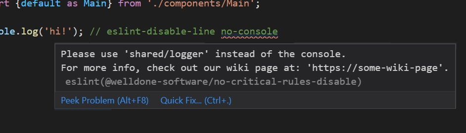

# @welldone-software/no-critical-rules-disable

This rule prevents the disabling of user defined critical rules with a custom message.

It's mostly useful to create an extra layer of defense for critical rules by:
* Adding an extra custom message for the chosen critical rules
* Forcing disabling chosen critical rules twice (the rule itself and this one)
* Making the chosen critical rules disables more noticiable in pull requests

For the config:
```json
{
  "rules": {
    "@welldone-software/no-critical-rules-disable": ["error", {
      "rules": {
        "no-console": "Please use 'shared/logger' instead of the console.\nFor more info, check out our wiki page at: 'https://some-wiki-page'."
      }
    }]
  }
}
```

When `no-console` is disabled, the chosen message for the rule appears as well:



## Fail
For the config above, the following `eslint-disable` of `no-console` lines will fail with the error specified in the config:

```js
/* eslint-disable no-console */

// ...

console.log('hi');
```

```js
console.log('hi'); // eslint-disable-line no-console
```

```js
// eslint-disable-next-line no-console
console.log('hi');
```

## Pass

* ### Pass option 1:
  Remove the eslint disable and fix the rule instead:
  ```js
  logger.log('hi');
  ```
* ### Pass option 2:
  Disable both rules:

  ```js
  /* eslint-disable no-console, @welldone-software/no-critical-rules-disable*/

  // ...

  console.log('hi');
  ```
  ```js
  console.log('hi'); // eslint-disable-line no-console, @welldone-software/no-critical-rules-disable
  ```
  ```js
  // eslint-disable-next-line @welldone-software/no-critical-rules-disable
  // eslint-disable-next-line no-console
  console.log('hi');
  ```

## Config

### rules
* Schema: `{[critical-rule-id]: {string|boolean}}`
* Default: `{}`

A list of rules to disable. Rules can receive a custom message or a boolean to use the defaultMessage.

### defaultMessage
* Schema: `string`
* Default: `'Are you sure you want to disable the critical rule "{{critical-rule-id}}"?'`

The message to display for rules configured with `true` where `{{critical-rule-id}}` instances are replaced with the rule's id.

```json
{
  "rules": {
    "@welldone-software/no-critical-rules-disable": ["error", {
      "rules": {
        "rule-1": true,
        "rule-2": "This rule should only be disabled if you know what you are doing",
        "rule-3": true
      },
      "defaultMessage": "{{critical-rule-id}}: Please don't disable {{critical-rule-id}} without reading the wiki."
    }]
  }
}
```

